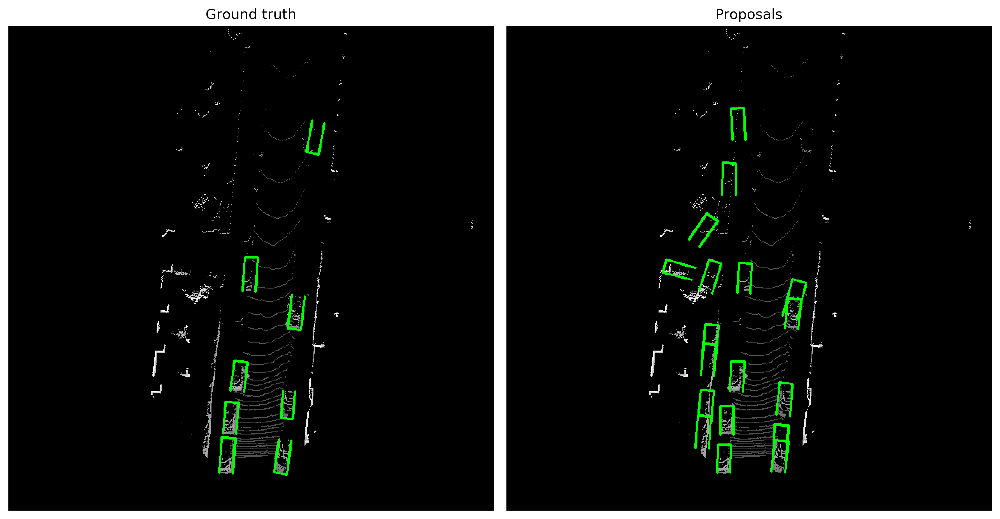
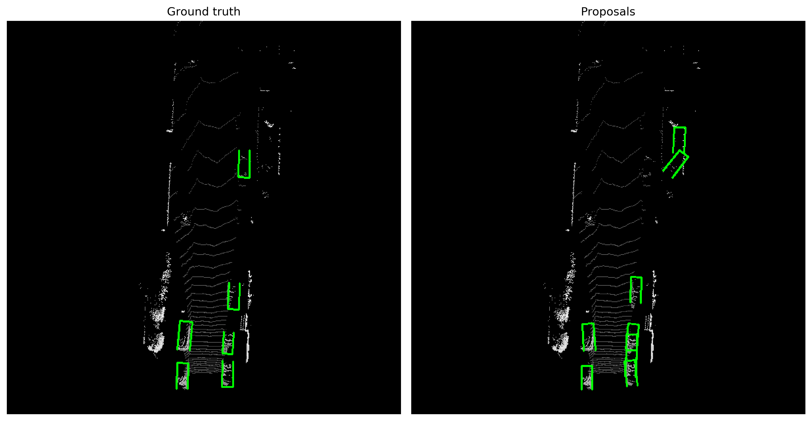
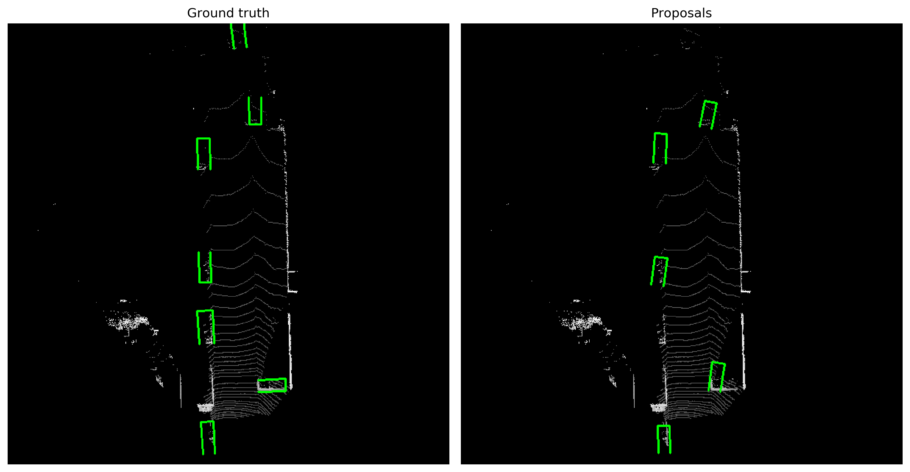
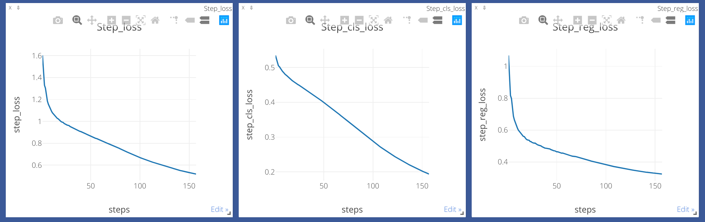

## Training instructions (details coming soon)

## Some Comments
1. Currently support training only proposal stage.
2. Still in beta stage but you are welcome to try -- may have bugs.
3. No multi-GPU support at the moment -- but training on KITTI is fast.
4. I assume velodyne points have already been filtered to camera field of view. I will release code soon to carry out this filtering. (As a crude approximation you can filter the points with a cone from +45 to +135 degrees.)
5. Support only KITTI dataset at the moment. I have tried to keep code general to allow adding support for new datasets.

## Preliminary results
Some comments:
- Note that these results are cherry-picked.
- Trained for 11 epochs using `car.yaml` model.
- Training proposal layer takes about 10 minutes per epoch.
- I will release the full inference code to generate these visualization shortly. (Need to clean up the code first.)

## Loss curves
Learning rate seems to need tuning (observe classification loss).

